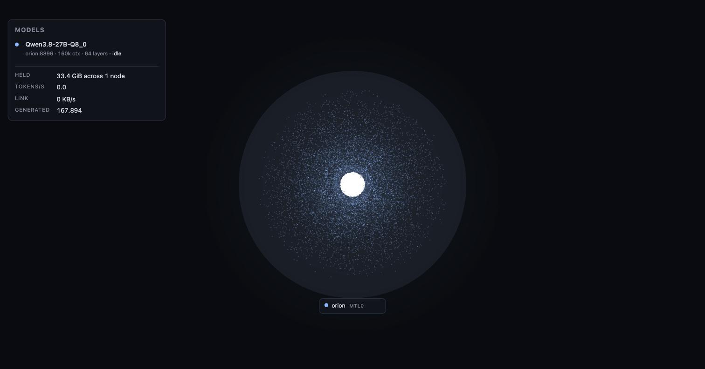
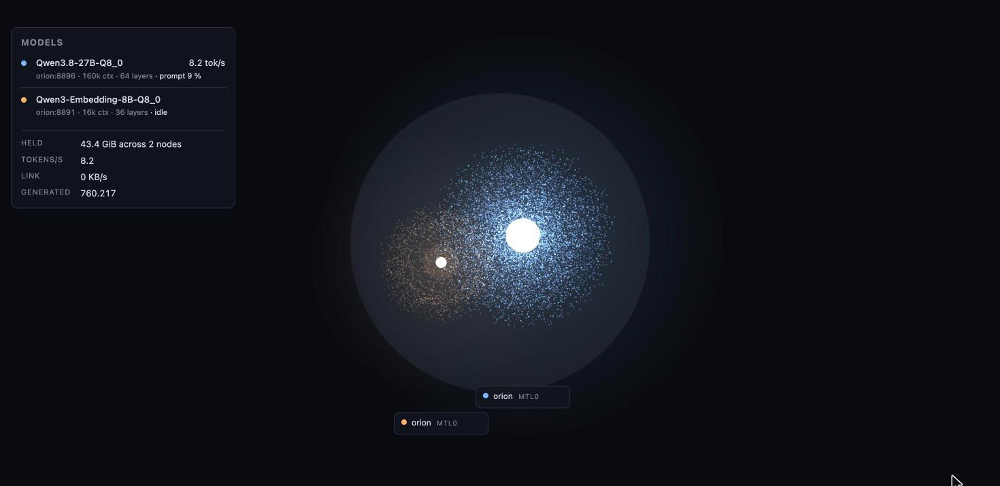
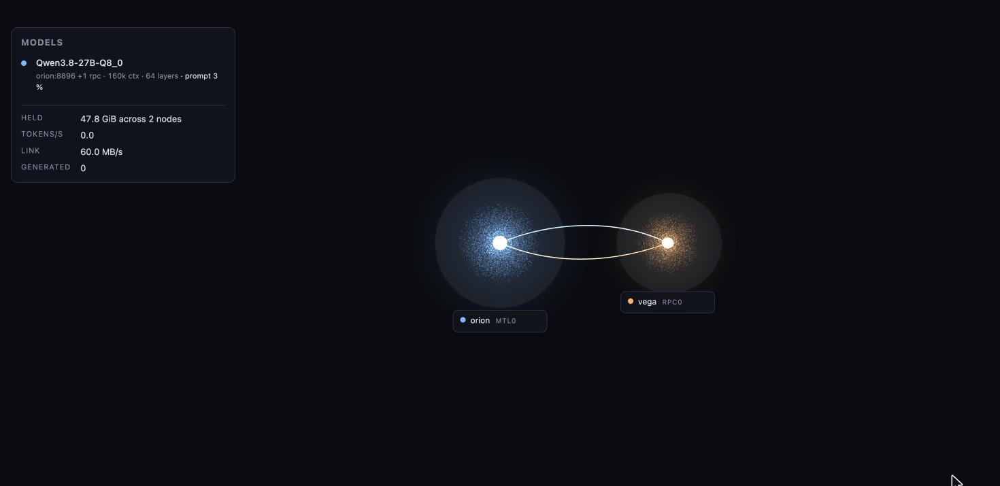
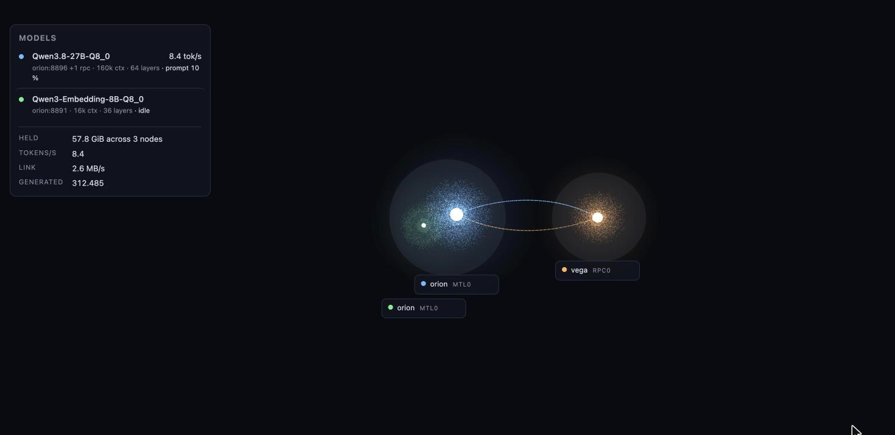

# llamesh

Live 3D view of the llama.cpp servers on your machines.

I built this because I was splitting a model across two Macs with llama.cpp's RPC backend and had no
way to see what was going on: which layers ended up where, how much memory each device had left, or how
much traffic the Thunderbolt link was carrying during a request. Log grepping got old.

llamesh is a small Go program you run on each host. It finds the `llama-server` processes itself, reads
their metrics and the memory table they print at load, and serves a page. Each model is a cloud of
particles sized by the memory it holds, sitting inside a faint sphere sized by the device's memory, so
you can see headroom. RPC links are drawn as streams of particles moving at the rate bytes actually
cross the wire. Zoom into a model and you pass through its layers to the context cache in the middle.









Hover a model in the list to fade everything else out, click to keep it that way. Click a body for the
numbers behind it; tick any of them to pin it as a label. Theme toggle top right.

Nothing on the page is configured. If it's drawn, it was read from a running server. The only config
is a list of other collectors to pull into the same page.

## Running

```
make
./llamesh
```

Needs Go 1.26 and Node 20 or 22 to build. The page is embedded in the binary; it serves on
`127.0.0.1:8899` by default.

| flag | default | |
|---|---|---|
| `-listen` | `127.0.0.1:8899` | where to serve |
| `-poll` | `1s` | |
| `-target` | | `http://127.0.0.1:PORT` to watch one server instead of all of them |
| `-sources` | | file listing other collectors, see below |

Two things about the servers themselves. Run them with `-lv 4`, otherwise llama.cpp doesn't print the
per-device memory table and the collector has nothing to size the bodies from. And run split models
with `--no-mmap`: with mmap the local Metal device maps the whole file, including the part the RPC node
holds, and you'll hit the wired memory limit at the first compute. Details in `SPEC.md`.

### More than one host

Run a collector on each host. Give one of them a file naming the others:

```yaml
sources:
  - http://10.0.0.2:8899
```

That collector proxies their streams under its own API, so the browser only ever talks to one address.
Useful when the other hosts are on a link the browser can't reach, like a Thunderbolt bridge. Only the
`- url` lines are read; it isn't a real YAML parser.

The collector has to run as the same user as the servers, because it reads their log files. On macOS,
if a collector needs to reach another machine, the binary needs Local Network permission the first time
(System Settings, Privacy & Security), and if the target machine has the firewall on, the binary has to
be allowed there. That caught me out twice.

## What it reads

- `lsof` for the listening `llama-server` processes, `ps` for each one's arguments (`--host`,
  `--api-key`, `--rpc`) and `lsof` again for its stderr file.
- `/props` once the model is up, then `/metrics` and `/slots` every poll.
- The `common_memory_breakdown_print` table in the server log, which is where every per-device number
  comes from. The collector never talks to an RPC node directly; llama.cpp's RPC server only takes one
  client and doesn't like being poked.
- Interface counters on whatever interface routes to each RPC node, for the link rates.
- mDNS for the RPC nodes' names, reverse DNS if that fails.

`SPEC.md` has the full list, with the llama.cpp version everything was checked against and the things
that turned out not to be readable.

## Hacking on it

`go test ./...` runs the parsers against recorded output in `testdata/`. `cd web && npm run dev` then
`?mock=1` gives you the page without a collector; `?mock=single|multi|rpc|multi-rpc` picks a scenario
and `&phase=prefill|generating|idle` freezes it, which is how the screenshots above were taken.

Go side is standard library only and I'd like to keep it that way. If you add something the page
draws, add where it comes from to `SPEC.md` and a recording of it to `testdata/`.

Apache 2.0.
